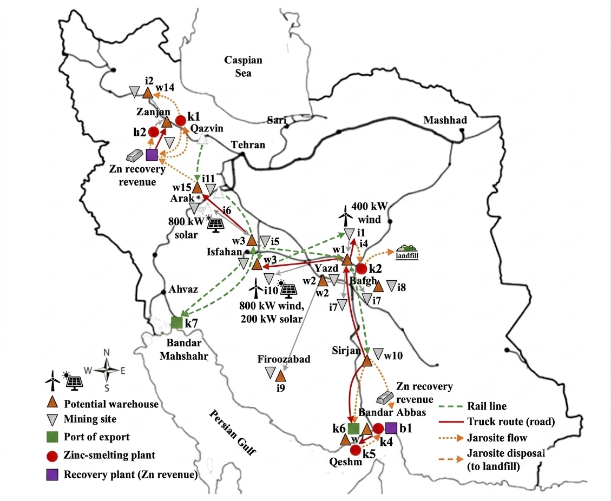

# zinc-supply-chain-optimization
MILP model for optimizing Iran's zinc concentrate supply chain with reverse logistics and sensitivity analysis — built with Python, Pyomo, and HiGHS

# Zinc Concentrate Supply Chain Optimization

A multi-period deterministic Mixed-Integer Linear Program (MILP) for optimizing Iran's zinc concentrate supply chain, built with Python, Pyomo, and HiGHS.

**Author:** Alireza Tajfar  
**Context:** Bachelor's thesis project

---

## Problem Overview

The model minimizes total supply chain cost across 6 bi-monthly periods, covering:

- 12 mines (with selectable capacity levels: small / medium / large)
- 15 candidate warehouse locations
- 7 demand centres (smelters and export ports)
- 3 zinc concentrate grades
- Truck and rail transport modes
- Wind and solar renewable energy installation decisions
- Integrated reverse logistics: jarosite waste recovery and zinc recycling

The objective balances economic cost against environmental and social constraints, making it a constrained sustainability-aware optimization rather than a pure cost minimization.

---

## Model Structure

| Component | Detail |
|---|---|
| Decision variables | ~4,500 (continuous + binary) |
| Constraints | 21 constraint families (C1–C21) |
| Time horizon | 6 periods (bi-monthly, 1 year) |
| Solver | HiGHS via Pyomo `appsi_highs` interface |
| MIP gap tolerance | 0.5% |
| Time limit | 600 seconds per solve |

**Key constraint groups:**

- **C1–C3** — Mine capacity level selection and production limits
- **C4–C6** — Energy balance and renewable generation limits
- **C7–C9** — Warehouse inventory balance and capacity
- **C10–C12** — Transport mode availability and rail capacity
- **C13** — Demand satisfaction (with shortage penalty)
- **C14** — Environmental cost upper bound per period
- **C15** — Minimum weighted social score per period
- **C16** — Minimum renewable energy share per period
- **C17–C21** — Reverse logistics: jarosite balance, recovery facility capacity, zinc recovery, minimum recovery share

---

## Sensitivity Analysis

The script automatically runs 30 sensitivity scenarios (6 parameters × 5 values) after the base run:

| Parameter | Meaning | Values tested |
|---|---|---|
| `alpha` | Minimum renewable energy share | 0.0, 0.15, 0.30, 0.45, 0.60 |
| `beta_min` | Minimum jarosite recovery share | 0.0, 0.10, 0.20, 0.40, 0.60 |
| `UB_E` | Environmental cost cap per period ($) | 450k – 650k |
| `LB_S` | Minimum social score per period | 320 – 340 |
| `rev_zn` | Recovered zinc revenue ($/t) | 1700 – 2800 |
| `env_disp` | Disposal environmental penalty ($/t) | 0 – 100 |

---

## Outputs

After a full run the script produces the following files in the same directory as the script:

- `zinc_model_output.log` — full console output for all 31 runs
- `sensitivity_results.csv` — KPI table across all 30 sensitivity runs
- `sensitivity_alpha.png` — objective vs. alpha chart
- `sensitivity_beta_min.png` — objective vs. beta_min chart
- `sensitivity_UB_E.png` — objective vs. UB_E chart
- `sensitivity_LB_S.png` — objective vs. LB_S chart
- `sensitivity_rev_zn.png` — objective vs. rev_zn chart
- `sensitivity_env_disp.png` — objective vs. env_disp chart

---

## Requirements

Python 3.9 or later is recommended.

```
pyomo>=6.7
highspy>=1.7
pandas>=2.0
matplotlib>=3.7
openpyxl>=3.1
```

Install all dependencies with:

```bash
pip install pyomo highspy pandas matplotlib openpyxl
```

`highspy` ships the HiGHS solver binary directly — no separate solver installation is needed.

---

## Data File

The model reads all input data from a single Excel workbook:

```
zinc_data.xlsx
```

This file must be placed in the **same folder as the script**. The sheet names are:

`Sets`, `Locations`, `MineCapacity`, `ProductionCost`, `HoldingCost`, `Demand`, `TransportParams`, `Dist_I_J`, `Dist_J_K_truck`, `Dist_J_K_rail`, `Cap_OD_truck`, `Cap_OD_rail`, `Cap_Mode`, `FixedRailCost`, `EA_Expected`, `Renewables`, `Social`, `ProductEnergy`, `EnergyCosts`, `EmissionFactors`, `UnitEnvCost`, `RenewableCapacity`, `RenewableInvestment`, `SocialWeights`, `InitialInventory`, `RecoveryParams`, `RecoveryCandidates`, `SmelterFlag`, `ReverseDist`

---

## How to Run

```bash
python zinc_supply_chain_model.py
```

The script runs the base case first (full verbose output), then the 30 sensitivity runs automatically. Total runtime depends heavily on hardware — expect anywhere from 30 minutes to several hours for all 31 solves.

---

## Project Layout

```
.
├── zinc_supply_chain_model.py   # Main model script
├── zinc_data.xlsx               # Input data
├── README.md                    # This file
├── zinc_model_output.log        # Generated on run
├── sensitivity_results.csv      # Generated on run
└── sensitivity_*.png            # Generated on run (6 charts)
```
